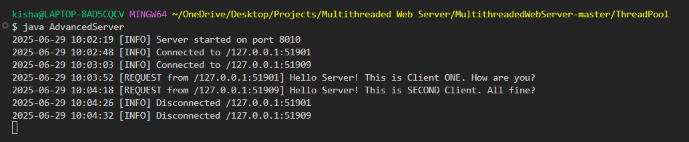
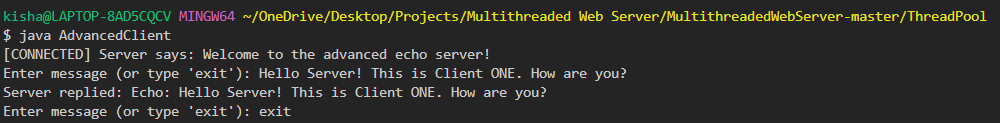
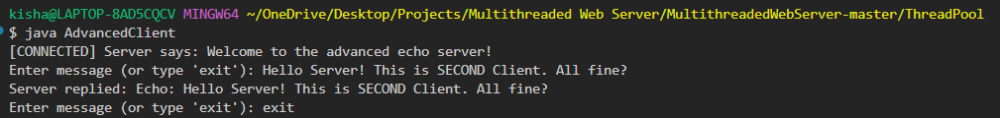

# ThreadNet: Java Multithreaded Echo WebServer

Developed a scalable Java-based multithreaded TCP socket server with thread pooling, IP-aware session logging, and interactive client communication.

---

## Overview

This project implements a robust and scalable multithreaded TCP echo server in Java using thread pooling. It demonstrates socket programming, concurrency, and server-client communication with logging and graceful shutdown support. Designed for real-world applications and high-performance scenarios, this implementation is suitable for showcasing backend development and networking concepts in production settings.

---

## Description

The server listens on a TCP port and handles each incoming client connection using a thread from a fixed thread pool. The client sends messages to the server, and the server responds with an echo of each message. Logging is implemented with precise timestamps and client IP tracking. Graceful shutdown is supported, ensuring resource cleanup when the server receives a termination signal (e.g., `Ctrl+C`).
The client supports interactive input and maintains an open session until the user types `exit`. Multiple clients can connect simultaneously, demonstrating the server’s concurrent handling capabilities. The code is modular and can be extended for further use cases such as command-based protocols or structured message handling.

--

## Features

- Fixed thread pool using `ExecutorService` to handle concurrent clients efficiently
- Bi-directional communication between server and clients over TCP
- Real-time server-side logging with timestamps and client IP
- Graceful shutdown via system signal (e.g., Ctrl+C)
- Clean separation of single-threaded, multithreaded, and thread pool implementations

---

## Tech Stack

- **Java SE 8+**
- **Java Sockets**: `ServerSocket`, `Socket`
- **Thread Pooling**: `Executors.newFixedThreadPool`
- **Multithreading**: `Runnable`, anonymous inner classes, and lambdas
- **Shutdown Hooks**: `Runtime.getRuntime().addShutdownHook`
- **Timestamping**: `SimpleDateFormat`, `Date`
- **Console Logging**: Standard output with error stream for exceptions
- **Stream Handling**: `BufferedReader`, `PrintWriter`, `InputStreamReader`

---

## Project Structure

```
MultithreadedWebServer-master/
├── singleThreaded/
│ ├── Server.java
│ └── Client.java
├── multiThreaded/
│ ├── Server.java
│ └── Client.java
├── threadPool/
│ ├── AdvancedServer.java
│ ├── AdvancedClient.java
│ └── test_logs/
│ ├── client1.png
│ ├── client2.png
│ └── server_log.png
└── README.md
```

---

## How to Run

### Compile

Navigate to the `threadPool/` folder and compile both server and client:

`javac AdvancedServer.java AdvancedClient.java`


### Run the Server

`java AdvancedServer`


The server will start listening on port `8010`.

### Run Clients (Multiple Terminals)

In separate terminal windows, run the client:

java AdvancedClient


Each client will connect, send messages, and receive echoed responses. To close a client session, type:

## Test Results

This project was tested with multiple concurrent clients. Each client sends multiple messages, and the server logs and echoes them in real-time.

### Server Console Output

Logs include timestamps, client IPs, incoming messages, and disconnect notices.



### Client 1 Output

Client connects to the server, sends messages, and receives echoed responses.



### Client 2 Output

Another client connects simultaneously and interacts with the server independently.



### Graceful Shutdown Log

The server shuts down cleanly on termination signal (`Ctrl+C`), releasing the server socket and thread pool.


---
